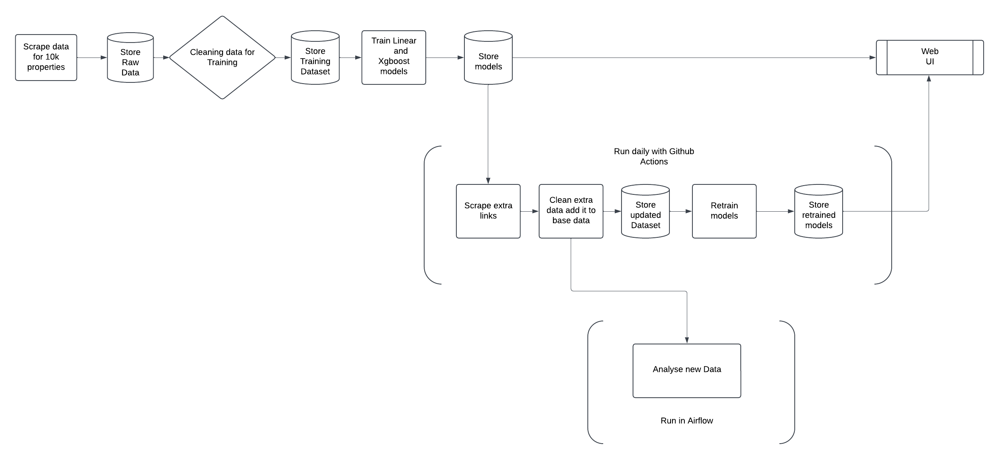
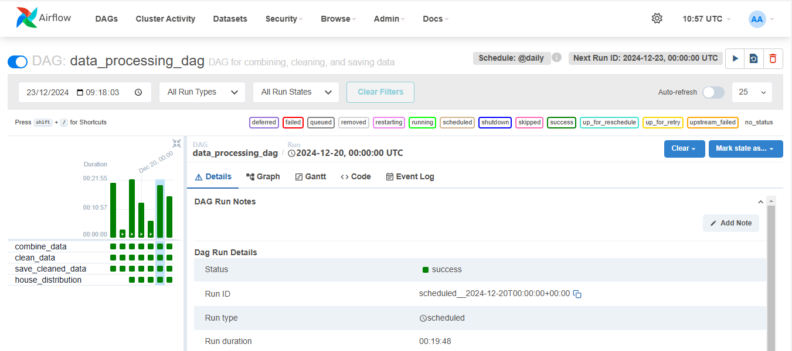

# immoeliza-pipeline


 

## Description

The pipeline is a combination of data scraping, model training, and automation processes to handle property data and maintain a predictive system. Automate all the workflow using github action. It consists of multiple stages:

1. Data Scraping and Storage:
     - Scrape data for 10,000 properties.
     - Store the raw data in a database for further processing.

2. Data Cleaning and Training Dataset Preparation:
     -  Clean the raw data to remove inconsistencies and prepare it for training.
     -  Store the cleaned data as a training dataset.

3. Model Training and Storage:
    - Train machine learning models, including linear and XGBoost models.
    - Store the trained models for later use.

4. Daily Updates with Automation (GitHub Actions):
    - Scrape additional links to collect new property data.
    - Clean the new data and append it to the base dataset.
    - Store the updated dataset for future training.

5. Model Retraining:
   - Retrain the models using the updated dataset.
-  - Store the retrained models for deployment.

6. Analysis and Workflow Automation (Airflow):
   - Analyze new data using retrained models to generate insights.
   - Automate this process using Apache Airflow to ensure seamless execution.

7. Web UI Integration:
   - The results, including predictions or insights, are made accessible via a web user interface.


## Repo Structure

```
├── .github/workflows
    ├── run_scraper_main.yml
├── DAGs
│   ├── airflow_analysis.py 
│── analysis
│       └── images 
        └── house_distribution.py
        └── merge_data.py
        └── price_distribution.py   
├── assets                   
├── deployment
├── ml
├── scraper/
├──.gitignore
├── README.md
└── requirements.txt

```
For GitHub Actions:
For GitHub Actions, no manual intervention is required. The process will be automated. It will automatically scrape and train the data. Upon modifying the data, the changes will be automatically saved in the modifying_scraper branch.

For Apache Airflow:
To run the analysis using Apache Airflow, follow these steps:
Initialize Apache Airflow: First, ensure Apache Airflow is properly initialized.
Run the Following Commands in Two Separate Ubuntu Terminals:

- In the first terminal, run the Airflow web server:
`airflow webserver`
- In the second terminal, run the Airflow scheduler:
`airflow scheduler`




## ⏱️ Timeline

This project took six days for completion.

## 📌 Contributors

This project was done as part of the AI Boocamp at BeCode.org. 

* 
* 
* 
* 
